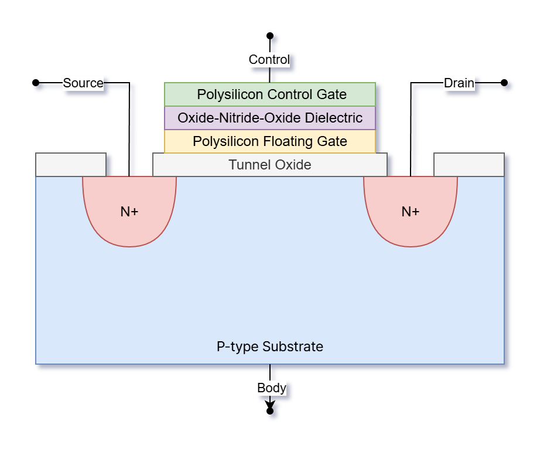

# NAND Flash-Based SSDs

## Memory

### Cell (MOSFET + Floating Gate)

---

## Controller

---

## References

- [M. Sadrosadati, O. Mutlu, "Understanding and Designing Modern NAND Flash-Based SSDs (Solid-State Drives)," SAFARI Research Group, ETH Zürich, 2023.](https://safari.ethz.ch/projects_and_seminars/spring2023/doku.php?id=modern_ssds)
