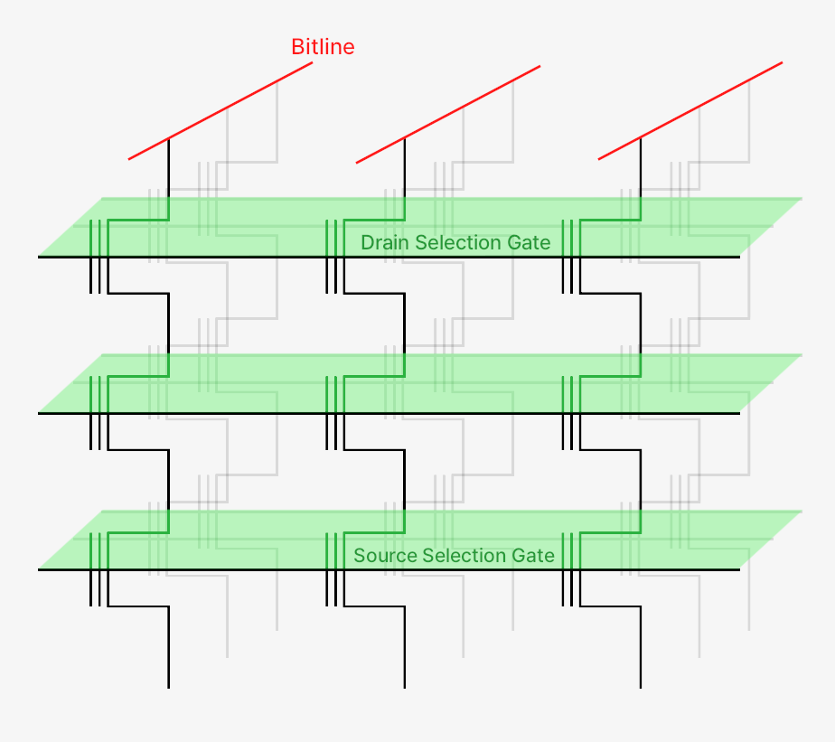

# NAND Flash-Based SSDs

## Memory

### Cell (MOSFET + Floating Gate)

- **Control Gate (Metal/Polysilicon):** Cell의 Threshold Voltage를 조절해 전자를 이동시킴
    - **Program:** Control Gate에 $\text{15-20 V}$ 사이의 고전압을 걸면 Threshold Voltage가 높아지며, Channel의 전자들이 Tunnel Oxide를 뚫고 Floating Gate로 이동 ($0$)
    - **Erase:** P-type Substrate (Semiconductor)에 $\text{15-20 V}$ 사이의 고전압을 걸면 Threshold Voltage가 낮아지며, Floating Gate에 저장된 전자들이 다시 Substrate 쪽으로 이동 ($1$)
- **Tunnel Oxide (Oxide):** Program/Erase 과정에 따라 전자가 통과하거나 전자의 이동을 막음
- **P-type Substrate (Semiconductor):** Source-Drain 사이의 Channel이 안정적으로 형성될 수 있도록 하는 P형 반도체 기판
- **Floating Gate (Polysilicon):** Fowler-Nordheim Tunneling을 통해 전자를 이동 및 방출하는 곳
- **Dielectric (Oxide-Nitride-Oxide):** 절연막을 통해 Floating Gate에 저장된 전자가 쉽게 빠져나가지 못하게 함

---

- **Multi-leveling:** Cell이 저장할 수 있는 Bit 개수는 Floating Gate에 저장할 수 있는 최대 전자 개수에 비례함
- **Retention Loss:** Floating Gate에 저장된 전자가 Tunnel Oxide의 앏은 두께와 결함으로 인해 서서히 빠져나가는 현상
- **Wearing:** Hot Electron들이 Tunnel Oxide를 왔다 갔다 하면서 산화막을 조금씩 손상시킴

---

### Cell (3D + Charge Trap Flash)

- "하나의 Wordline 층이 감싸는 Channel 기둥의 일부"
  - **"Macaroni" Oxide Filler:** Source-Drain 전류가 흐르는 Channel 부분 안쪽을 지지 및 절연
  - **Silicon Nitride (Charge Trap):** Floating Gate 역할로, Program/Erase 과정에 따라 전자 이동
  - **Wordline:** Control Gate 역할로, Threshold Voltage를 조절

---

### Page, Block과 Plane

- **NAND String:** Cell을 직렬로 연결해 만든 Channel 기둥
    - **Bitline:** String의 모든 Cell을 순서대로 읽거나 쓰는 용도로, Channel 최상단에 위치함
    - **Wordline:** Layer의 모든 Cell을 한번에 선택하는 용도로, Cell 중심부를 감싸고 있음

- **Page:** 하나의 Wordline에 연결된 모든 Cell의 집합 (하나의 Wordline 층)으로, Program 연산의 기본 단위
    - **Erase-before-Write:** Floating Gate 또는 Charge Trap에서 전자를 다 빼야 Cell의 내용을 변경 가능

- **Block:** 여러 Wordline을 공유하는 Page의 집합 (여러 개의 Wordline 층)으로, Erase 연산의 기본 단위
  - 하나의 Block에 속한 Page 수는 Wordline의 개수와 Cell이 저장할 수 있는 비트 수의 곱으로 결정

- **Plane:** 여러 Bitline을 공유하는 Block의 집합

---

### Threshold Voltage Distribution

### Incremental Step-Pulse Programming (ISPP)

> The concept of Incremental Step-Pulse Programming (ISPP) can be thought of as seasoning 'soup', where 'soup' represents the amount of electrons trapped in the Floating Gate. 
> 
> The program pulse voltage is increased step by step, much like adding salt little by little. After each pulse, a verify operation checks the 'saltiness' (threshold voltage) of the 'soup,' until the desired level is reached.
> 
> The situation where you have to throw away your 'soup' because it's too salty (exceeds the desired voltage level) is called over-programming.
>
> — [Jaedeok Kim](https://github.com/jdeokkim)

---

## Controller

---

## References

- [M. Sadrosadati, O. Mutlu, "Understanding and Designing Modern NAND Flash-Based SSDs (Solid-State Drives)," SAFARI Research Group, ETH Zürich, 2023.](https://safari.ethz.ch/projects_and_seminars/spring2023/doku.php?id=modern_ssds)
