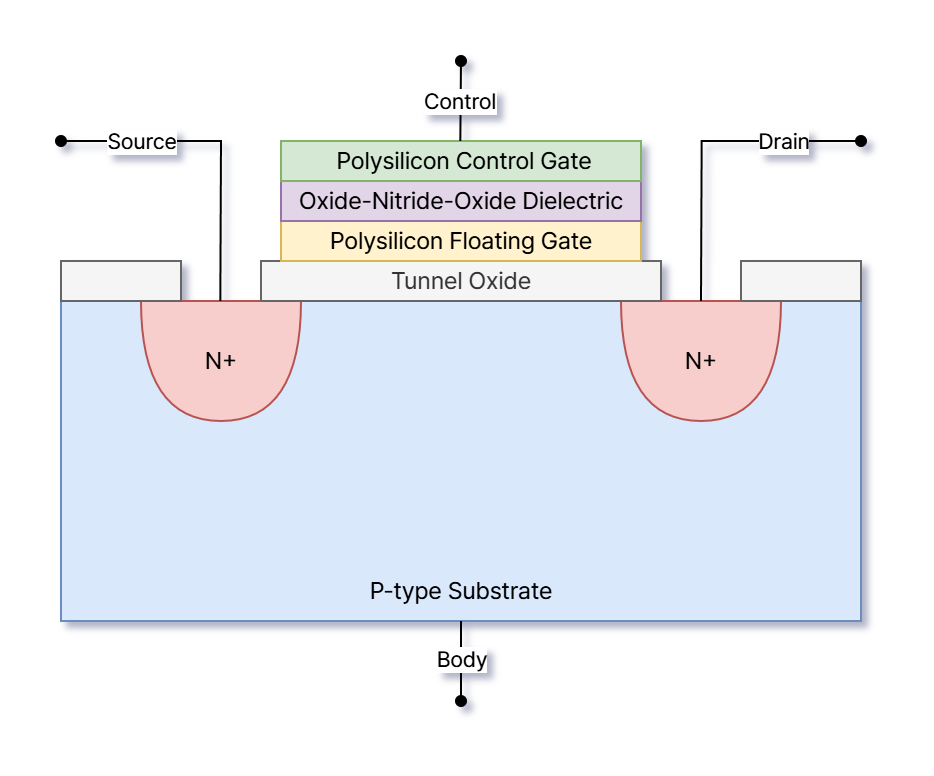

# NAND Flash-Based SSDs

## Memory

### Cell (MOSFET + Floating Gate)

- **Control Gate (Metal/Polysilicon):** Cell의 Threshold Voltage를 조절해 전자를 이동시킴
    - **Program:** Control Gate에 $\text{15-20 V}$ 사이의 고전압을 걸면 Threshold Voltage가 높아지며, Channel의 전자들이 Tunnel Oxide를 뚫고 Floating Gate로 이동 ($1$)
    - **Erase:** P-type Substrate (Semiconductor)에 $\text{15-20 V}$ 사이의 고전압을 걸면 Threshold Voltage가 낮아지며, Floating Gate에 저장된 전자들이 다시 Substrate 쪽으로 이동 ($0$)
- **Tunnel Oxide (Oxide):** Program/Erase 과정에 따라 전자가 통과하거나 전자의 이동을 막음
- **P-type Substrate (Semiconductor):** Source-Drain 사이의 Channel이 안정적으로 형성될 수 있도록 하는 P형 반도체 기판
- **Floating Gate (Polysilicon):** Fowler-Nordheim Tunneling을 통해 전자를 이동 및 방출하는 곳
- **Dielectric (Oxide-Nitride-Oxide):** 절연막을 통해 Floating Gate에 저장된 전자가 쉽게 빠져나가지 못하게 함

---

- **Multi-leveling:** Cell이 저장할 수 있는 Bit 개수는 Floating Gate에 저장할 수 있는 최대 전자 개수에 비례함
- **Retention Loss:** Floating Gate에 저장된 전자가 Tunnel Oxide의 앏은 두께와 결함으로 인해 서서히 빠져나가는 현상
- **Wearing:** Hot Electron들이 Tunnel Oxide를 왔다 갔다 하면서 산화막을 조금씩 손상시킴

---

### Cell (3D + Charge Trap Flash)

- **"Macaroni" Oxide Filler:** Source-Drain 전류가 흐르는 Channel 부분 안쪽을 지지 및 절연
- **Silicon Nitride (Charge Trap):** Floating Gate 역할로, Program/Erase 과정에 따라 전자 이동
- **Wordline:** Control Gate 역할로, Threshold Voltage를 조절

---

### Page

---

## Controller

---

## References

- [M. Sadrosadati, O. Mutlu, "Understanding and Designing Modern NAND Flash-Based SSDs (Solid-State Drives)," SAFARI Research Group, ETH Zürich, 2023.](https://safari.ethz.ch/projects_and_seminars/spring2023/doku.php?id=modern_ssds)
